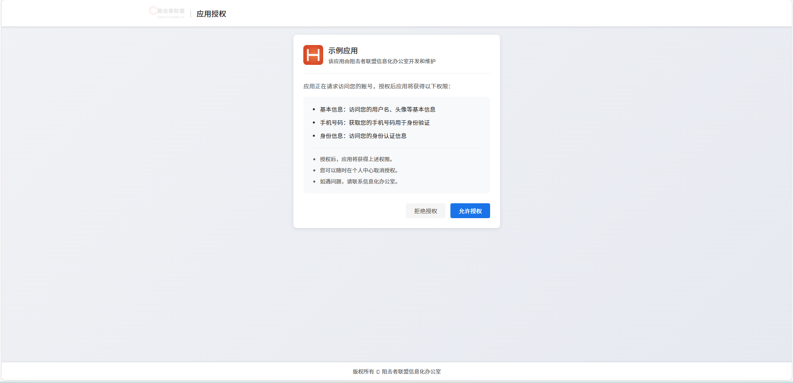
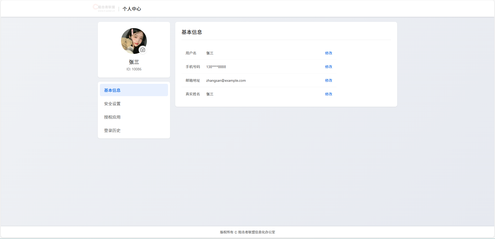
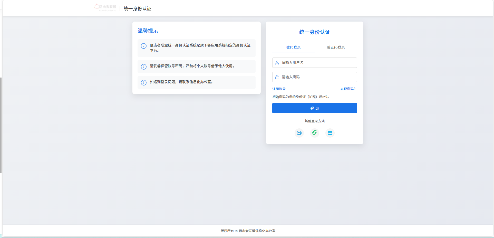
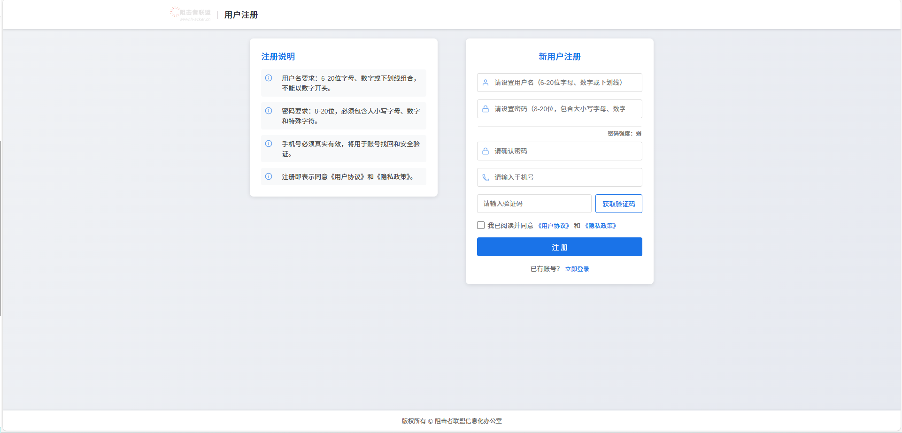
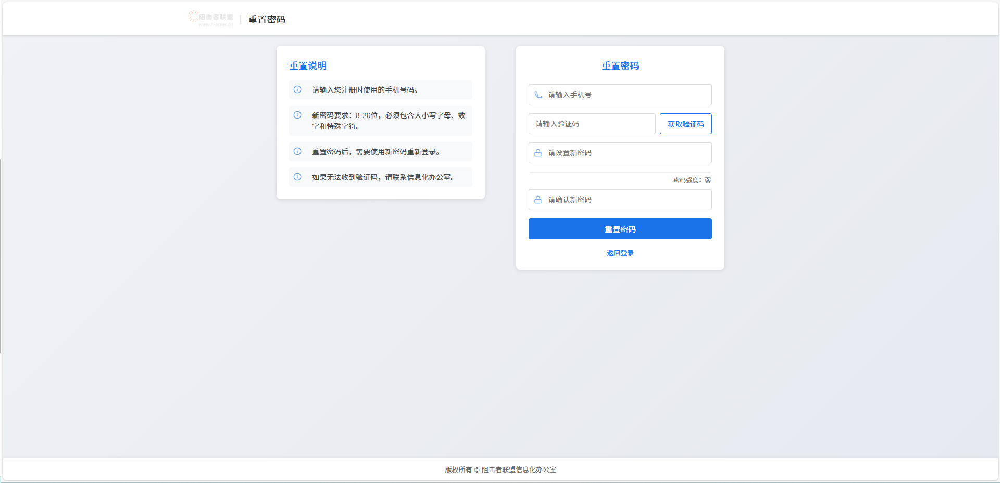

# SSO 统一身份认证系统 UI

这是一个现代化的单点登录（SSO）系统前端界面，提供了美观、响应式的用户认证体验。

## 功能特点

- 响应式设计，完美支持移动端和PC端
- 现代化UI界面，提供流畅的用户体验
- 支持多种登录方式（账号密码、手机验证码、微信）
- 内置温馨提示功能
- 表单验证和错误提示
- 动画效果增强

## 技术栈

- HTML5
- CSS3
- JavaScript (原生)
- SVG 图标（Base64编码）

## 开始使用

1. 克隆本仓库
2. 使用现代浏览器打开 `index.html` 文件
3. 默认测试账号：
   - 用户名：admin
   - 密码：123456

## 浏览器支持

- Chrome (最新版本)
- Firefox (最新版本)
- Safari (最新版本)
- Edge (最新版本)
- Opera (最新版本)

## 示例页面

